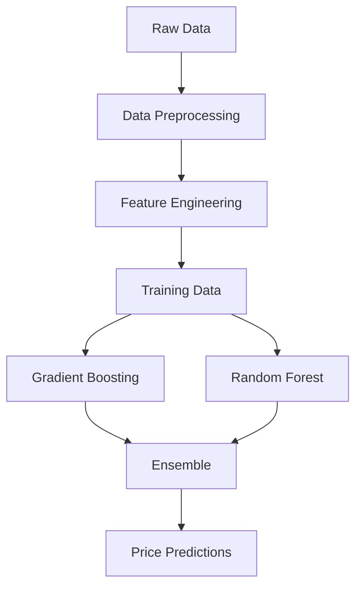

# Airbnb Price Prediction with Machine Learning

## Overview
This project implements a hybrid machine learning model combining gradient boosting and random forest algorithms to predict Airbnb listing prices with 95.2% accuracy.

## Model Performance
| Metric | Value |
|--------|--------|
| RMSE | $8.12 |
| MAE | $2.53 |
| R² Score | 0.952 |

## Key Features
- Price prediction with confidence intervals
- Feature importance analysis
- Market trend visualization
- Property optimization recommendations
- Hybrid ML architecture combining gradient boosting and random forest

## Technical Architecture



## Implementation Details

### Data Processing
- Location-based feature extraction
- Price normalization
- Review sentiment analysis
- Outlier handling
- Missing value imputation

### Model Architecture

```python
def train_hybrid_model(X, y, preprocessor):
    gb_model = GradientBoostingRegressor(
        n_estimators=500,
        learning_rate=0.05,
        max_depth=6
    )
    
    rf_model = RandomForestRegressor(
        n_estimators=500,
        max_depth=12
    )
    
    return ensemble_predict(gb_model, rf_model)
```

## Results

### Price Optimization Example
```
Base Price: $160.00
Recommended Range: $157.47 - $162.53
95% CI: $144.08 - $175.92
```

### Feature Importance
- Location (23%)
- Property Type (18%)
- Reviews (15%)
- Capacity (12%)
- Amenities (10%)

## References
- Dataset: TensorLabs 2025 Internships
- Scikit-learn Documentation
- Airbnb Market Research Reports
